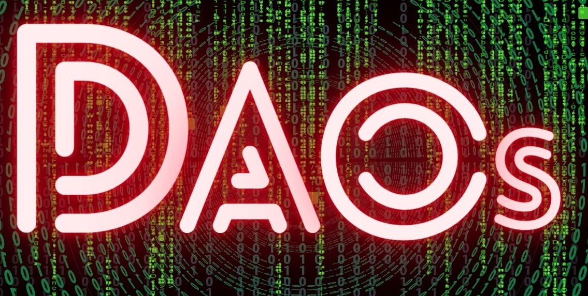

# Foundry DAO Governance



1. We are going to have a contract controlled by a DAO ✅

2. Every transaction that the DAO wants to send has to be voted on ✅

3. We will user ERC20 tokens for voting ✅

## Quickstart

```
git clone https://github.com/Solidityarchitect/foundry-dao
cd foundry-dao
forge install
forge build
```

# Usage

## Test

```
forge test
```

## Deploy

I did not write deploy scripts for this project, you can if you'd like!

## Estimate gas

You can estimate how much gas things cost by running:

```
forge snapshot
```

And you'll see and output file called `.gas-snapshot`

# Formatting

To run code formatting:

```
forge fmt
```
